# CI Pipeline Excellence - Comprehensive Update

A production-ready, comprehensive CI/CD pipeline framework with advanced deployment control, multi-environment management, and testable DRY scripts. This system supports monorepo deployments with sub-project versioning, environment-specific git tags, and SOPS-encrypted secrets.

## 🎯 Key Features

- **Pipeline Reports with Action Links**: Comprehensive completion reports with actionable links for promoting releases, triggering rollbacks, assigning states, and running maintenance tasks
- **Advanced Git Tags**: Three-tier tag system (version, environment, state) with deployment control and protection
- **Multi-Environment Management**: Hierarchical configuration with region support and encrypted secrets
- **Testable DRY Scripts**: All pipeline logic extracted into standalone, testable script files with hierarchical testability control
- **Enhanced Quality Gates**: Secret scanning, small focused scripts, stable versioning, and commit message enforcement
- **Self-Healing Pipeline**: Auto-format and lint fix capabilities with automated commit creation

## 📋 Table of Contents

- [Quick Start](#quick-start)
- [Prerequisites](#prerequisites)
- [Migration Guide](#migration-guide)
- [Integration Examples](#integration-examples)
- [Architecture](#architecture)
- [Tag System](#tag-system)
- [Environment Management](#environment-management)
- [Testing](#testing)
- [Local Development](#local-development)
- [Configuration](#configuration)
- [Security](#security)
- [Contributing](#contributing)

## 🚀 Quick Start

### 1. Setup Development Environment

```bash
# Clone repository
git clone https://github.com/your-org/ci-excellence.git
cd ci-excellence
git checkout 002-ci-pipeline-update

# Install MISE (if not already installed)
curl https://mise.run | sh
eval "$(mise activate bash)"

# Install all required tools and setup environment
mise run dev-setup
```

### 2. Configure Environment

```bash
# Create local environment file
cp config/.env.template .env.local

# Initialize secrets for local development
mise run secrets-init local

# Edit secrets (encrypted with SOPS)
mise run edit-secrets

# Verify setup
mise run profile-status
mise run verify-tools
```

### 3. Make Your First Commit

```bash
# Create a test file
echo "# Test" > test.md

# Commit (hooks will run automatically)
git add test.md
git commit -m "feat: add test file"

# Push to trigger pipeline
git push origin 002-ci-pipeline-update
```

## ✅ Prerequisites

### System Requirements

- **OS**: Linux, macOS, or Windows with WSL2
- **Git**: Version 2.30 or higher
- **Shell**: Bash 5.x, ZSH, or Fish
- **MISE**: Latest version (for tool management)

### Required Accounts

- **GitHub**: Repository with GitHub Actions enabled
- **Admin access**: For initial setup and emergency overrides

## 🔄 Migration Guide

Migrating from existing CI/CD systems is straightforward with our comprehensive migration guide:

### Quick Migration Path

1. **Assess Current Setup**: Inventory existing workflows and configurations
2. **Choose Migration Strategy**: Big Bang, Phased, or Parallel migration
3. **Install Framework**: `mise run dev-setup` to install prerequisites
4. **Configure Environments**: Migrate environment variables and secrets
5. **Update Workflows**: Replace existing CI/CD files with framework workflows
6. **Validate and Test**: Run dry-run deployments and security scans

### Migration Resources

- 📖 **[Complete Migration Guide](docs/migration-guide.md)** - Step-by-step instructions for migrating from GitHub Actions, GitLab CI, Jenkins, and other systems
- 🔧 **[Migration Templates](config/templates/examples/)** - Ready-to-use configurations for different project types
- ✅ **[Validation Checklist](docs/migration-guide.md#-validation-checklist)** - Ensure your migration is complete and working

### Supported Migrations

- **GitHub Actions** → CI Excellence Framework (seamless transition)
- **GitLab CI** → Framework with equivalent workflows
- **Jenkins** → Container-based deployments with framework
- **Azure DevOps** → GitHub-based workflows
- **CircleCI** → Enhanced security and multi-environment support

## 🎯 Integration Examples

Get started quickly with our comprehensive integration examples:

### Available Examples

- **[Node.js Express API](config/templates/examples/nodejs-express/)** - REST API with MongoDB, Docker, JWT auth
- **[Python FastAPI](config/templates/examples/python-fastapi/)** - High-performance async API with PostgreSQL
- **[Go Microservice](config/templates/examples/go-microservice/)** - gRPC service with Prometheus metrics
- **[React Frontend](config/templates/examples/react-frontend/)** - SPA with TypeScript and E2E testing
- **[Terraform Infrastructure](config/templates/examples/terraform-infrastructure/)** - IaC with multi-environment support
- **[Nx Monorepo](config/templates/examples/monorepo-nx/)** - Complex monorepo with multiple applications

### Quick Start with Examples

```bash
# Choose an example and copy it
cp -r config/templates/examples/nodejs-express/ /path/to/your-project/
cd /path/to/your-project

# Customize for your needs
vim environments/staging/config.yml
mise run edit-secrets

# Test the integration
CI_TEST_MODE=dry_run ./scripts/deployment/10-ci-deploy-staging.sh validate
```

### Example Features

Each example includes:
- ✅ Pre-configured environment files
- ✅ Custom build and test scripts
- ✅ Docker containerization
- ✅ Security scanning configuration
- ✅ Deployment manifests
- ✅ Complete setup documentation

## 🏗️ Architecture

### Workflow Overview

```mermaid
graph TB
    Dev[Developer] --> Push[Git Push]
    Push --> PR[Pull Request]
    Push --> Tag[Version Tag]

    PR --> PreRelease[Pre-Release Pipeline]
    Tag --> TagAssignment[Tag Assignment Pipeline]

    PreRelease --> Success[✅ All Checks Pass]
    TagAssignment --> EnvTag[Environment Tag Created]

    Success --> Merge[Merge to Main]
    EnvTag --> Deployment[Deployment Pipeline]

    Deployment --> Verify[Post-Release Verification]
    Deployment --> Maintenance[Background Maintenance]

    Maintenance --> Cleanup[Artifact Cleanup]
    Verify --> Rollback[Rollback if Needed]
    Rollback --> Stable[Mark as Stable]

    classDef success fill:#e8f5e8,stroke:#4caf50
    classDef warning fill:#fff3cd,stroke:#ff9800
    classDef error fill:#ffebee,stroke:#f44336

    class Success,Stable success
    class Rollback warning
```



### Detailed Workflow Architecture


### CI/CD Workflow Matrix

| Workflow | Trigger | Purpose | Environment | Security Level |
|----------|---------|---------|-------------|----------------|
| **Pre-Release** | Pull Request, Push to develop | Code quality & testing | Development | Medium |
| **Tag Assignment** | Manual dispatch, Release trigger | Environment & state management | All | High |
| **Release** | Version tag push | Multi-platform publishing | N/A | High |
| **Deployment** | Environment tag creation | Multi-environment deployment | Target Env | High |
| **Post-Release** | Manual dispatch, Release completion | Verification & maintenance | All | Medium |
| **Maintenance** | Scheduled cron | Background tasks & cleanup | All | Low |
| **Auto-Fix** | Manual dispatch | Code formatting & fixes | Development | Low |
| **Rollback** | Manual dispatch | Emergency rollback | Target Env | Critical |

### Workflow Details

#### Pre-Release Pipeline


#### Deployment Pipeline


#### Tag Assignment System

```mermaid
graph TD
    subgraph "Tag Types"
        Version[Version Tags<br/>v1.2.3<br/>api/v2.1.0<br/>frontend/v1.0.0-beta.1]
        Environment[Environment Tags<br/>production<br/>staging<br/>api/production]
        State[State Tags<br/>v1.2.3-stable<br/>v2.1.0-unstable<br/>v1.0.0-deprecated]
    end

    subgraph "Tag Operations"
        Create[Create Version Tag] --> Assign[Assign Environment Tag]
        Assign --> Mark[Mark State Tag]
        Mark --> Move[Move Environment Tag]
        Move --> Protect[Protected from Manual Creation]
    end

    subgraph "Tag Protection"
        Protected[✅ Protected Tags]
        Protected -->|CI Mediation Required| Manual[🚫 Manual Creation Blocked]
        Protected -->|Auto-creation| CI[🤖 CI-Generated Only]
    end

    classDef version fill:#e8f5e8,stroke:#4caf50
    classDef environment fill:#e3f2fd,stroke:#2196f3
    classDef state fill:#fff3e0,stroke:#ff9800
    classDef protection fill:#fce4ec,stroke:#e91e63

    class Version version
    class Environment environment
    class State state
    class Protected,CI protection
```



#### Security Flow


#### Rollback Process


#### Complete Workflow Integration

```mermaid
flowchart TB
    subgraph "Development Workflow"
        Dev[Developer Workflow]
        Dev --> Commit[Git Commit]
        Commit --> PR[Pull Request]
        PR --> PreRelease[🧪 Pre-Release Pipeline]
    end

    subgraph "Quality Gates"
        PreRelease --> Quality[✅ Quality Gates Passed?]
        Quality -->|Yes| ReleaseReady[Ready for Release]
        Quality -->|No| Fix[🔧 Code Fixes]
        Fix --> Dev
    end

    subgraph "Release Workflow"
        ReleaseReady --> Tag[🏷️ Create Version Tag]
        Tag --> TagAssign[📋 Tag Assignment Pipeline]
        TagAssign --> Release[🚀 Release Pipeline]
        Release --> MultiPlatform[Multi-Platform Publishing]
    end

    subgraph "Deployment Workflow"
        MultiPlatform --> DeployTrigger[Environment Tag Trigger]
        DeployTrigger --> Deploy[🎯 Deployment Pipeline]
        Deploy --> DeploySuccess[✅ Deployment Success]
        Deploy --> DeployFail[❌ Deployment Failed]
        DeployFail --> Rollback[🔄 Rollback Pipeline]
    end

    subgraph "Operations Workflow"
        DeploySuccess --> Verify[✅ Post-Release Verification]
        Verify --> Maintain[🔧 Maintenance Pipeline]
        Rollback --> Verify
        Maintain --> Monitor[📊 Monitoring & Alerts]
    end

    subgraph "Security & Compliance"
        PreRelease --> SecurityScan[🔒 Security Scanning]
        Release --> SecurityAudit[🛡️ Security Audit]
        Deploy --> SecurityValidate[🔍 Security Validation]
        Monitor --> SecurityAlert[🚨 Security Alerts]
    end

    subgraph "Automation & Self-Healing"
        Maintain --> AutoFix[🤖 Auto-Fix Pipeline]
        SecurityAlert --> Response[⚡ Incident Response]
        Monitor --> Cleanup[🧹 Artifact Cleanup]
    end

    classDef dev fill:#e3f2fd,stroke:#2196f3
    classDef quality fill:#f3e5f5,stroke:#9c27b0
    classDef release fill:#e8f5e8,stroke:#4caf50
    classDef deploy fill:#fff3e0,stroke:#ff9800
    classDef ops fill:#fce4ec,stroke:#e91e63
    classDef security fill:#ffebee,stroke:#f44336
    classDef auto fill:#e8eaf6,stroke:#3f51b5

    class Dev,Commit,PR dev
    class Quality,ReleaseReady,Fix quality
    class Tag,TagAssign,Release,MultiPlatform release
    class DeployTrigger,Deploy,DeploySuccess,DeployFail,Rollback deploy
    class Verify,Maintain,Monitor ops
    class SecurityScan,SecurityAudit,SecurityValidate,SecurityAlert security
    class AutoFix,Response,Cleanup auto
```



### Directory Structure

```
.
├── .github/
│   └── workflows/
│       ├── pre-release.yml      # PR and dev branch CI
│       ├── release.yml          # Version tag triggered releases
│       ├── post-release.yml     # Post-deployment verification
│       ├── maintenance.yml      # Cron-based background tasks
│       ├── tag-assignment.yml   # Environment tag management
│       ├── deployment.yml       # Environment deployments
│       ├── rollback.yml         # Rollback workflows
│       └── self-healing.yml     # Code formatting and linting fixes
│
├── scripts/
│   ├── setup/                   # Environment preparation
│   ├── build/                   # Compilation, linting, security
│   ├── test/                    # Test execution
│   ├── release/                 # Versioning and publishing
│   ├── deployment/              # Environment deployment
│   ├── maintenance/             # Cleanup and audits
│   ├── hooks/                   # Git hooks for Lefthook
│   ├── ci/                      # CI utilities
│   ├── profile/                 # MISE profile management
│   ├── secrets/                 # Secret management
│   ├── tools/                   # Tool verification and setup
│   └── shell/                   # Shell integration
│
├── environments/
│   ├── global/                  # Cross-environment resources
│   ├── staging/                 # Staging-specific config
│   │   └── regions/
│   ├── production/              # Production-specific config
│   │   └── regions/
│   ├── canary/                  # Optional environment
│   ├── sandbox/                 # Optional environment
│   └── performance/             # Optional environment
│
├── config/
│   ├── .env.template            # Environment variable template
│   └── .env.local               # Local development variables
│
├── .secrets/
│   └── mise-age.txt             # Age key pair for SOPS encryption
│
├── tests/                       # ShellSpec tests
├── config/
│   ├── templates/               # Script and project templates
│   │   └── examples/            # Example projects
│   └── *.template               # Configuration templates
└── docs/                        # Documentation
```

## 🏷️ Tag System

### Three-Tier Tag Architecture

1. **Version Tags**: `v1.2.3`, `api/v2.1.0`, `frontend/v1.0.0-beta.1`
   - Immutable markers for releases
   - Support sub-project paths for monorepos
   - Follow semantic versioning

2. **Environment Tags**: `production`, `staging`, `api/production`, `services/auth/staging`
   - Movable markers for deployment targeting
   - Protected from manual creation
   - Trigger deployments automatically

3. **State Tags**: `v1.2.3-stable`, `v2.1.0-unstable`, `v1.0.0-deprecated`
   - Immutable stability markers
   - Communicate version status
   - Support rollback decisions

### Tag Patterns

```bash
# Version tags (immutable)
v1.2.3
api/v2.1.0
frontend/v1.0.0-beta.1

# Environment tags (movable)
production
api/production
services/auth/staging

# State tags (immutable)
v1.2.3-stable
api/v2.1.0-unstable
frontend/v1.0.0-deprecated
```

### Tag Operations

```bash
# Create version tag (triggers release pipeline)
git tag -a v1.2.3 -m "Release version 1.2.3"
git push origin v1.2.3

# Assign environment tag via CI
gh workflow run tag-assignment.yml \
  --field tag_type=environment \
  --field subproject=api \
  --field version=v1.2.3 \
  --field environment=production

# Mark version as stable
gh workflow run tag-assignment.yml \
  --field tag_type=state \
  --field subproject=api \
  --field version=v1.2.3 \
  --field state=stable
```

## 🌍 Environment Management

### Hierarchical Configuration

```
environments/
├── global/
│   ├── config.yml              # Global settings
│   └── secrets.enc             # Global secrets (SOPS encrypted)
├── production/
│   ├── config.yml              # Production-specific config
│   ├── secrets.enc             # Production secrets
│   └── regions/
│       ├── us-east/
│       │   └── config.yml      # Region-specific settings
│       └── eu-west/
│           └── config.yml
└── staging/
    ├── config.yml              # Staging-specific config
    ├── secrets.enc             # Staging secrets
    └── regions/
        ├── us-east/
        └── eu-west/
```

### Profile Management

```bash
# Switch between environments
mise run switch-profile staging
mise run switch-profile production

# View current profile
mise run profile-status

# ZSH plugin integration (if installed)
mise_switch staging
mise_profile_status
```

### Secret Management

```bash
# Edit environment secrets
mise run decrypt-production
# Edit environments/production/secrets.enc
mise run encrypt-production

# Rotate encryption keys
mise run secrets-rotate
```

## 🧪 Testing

### Script Testability

All CI scripts support hierarchical testability control:

```bash
# Global testability mode
CI_TEST_MODE=DRY_RUN ./scripts/build/compile.sh

# Script-specific testability
CI_COMPILE_BEHAVIOR=FAIL ./scripts/build/compile.sh

# Pipeline-level override
PIPELINE_SCRIPT_COMPILE_BEHAVIOR=EXECUTE ./scripts/build/compile.sh
```

### Test Modes

- **EXECUTE**: Normal script execution (default)
- **DRY_RUN**: Simulate execution without side effects
- **PASS**: Force success for testing
- **FAIL**: Force failure for testing
- **SKIP**: Skip execution
- **TIMEOUT**: Simulate timeout for testing

### Running Tests

```bash
# Run all tests
mise run test

# Run tests with coverage
mise run test-coverage

# Test specific file
shellspec tests/scripts/build/compile_spec.sh

# Test scripts locally
CI_TEST_MODE=DRY_RUN ./scripts/build/10-ci-compile.sh
```

## 💻 Local Development

### Environment Setup

```bash
# Install all required tools
mise install

# Verify tool installation
mise run verify-tools

# Setup development environment
mise run dev-setup

# Initialize git hooks
mise run install-hooks
```

### Shell Integration

```bash
# ZSH plugin (if using ZSH)
mise_switch staging          # Quick profile switch
mise_profile_status         # Show current profile

# Shell integration setup
./scripts/shell/setup-shell-integration.sh
```

### Local Pipeline Testing

```bash
# Test GitHub Actions locally
act -j pre-release

# Dry run mode
act -j pre-release --dry-run

# Test with specific inputs
act -j deployment \
  -s GITHUB_TOKEN=$GITHUB_TOKEN \
  -input environment=staging \
  -input version_tag=v1.0.0
```

## ⚙️ Configuration

### MISE Configuration

The `mise.toml` file manages tools and tasks:

```toml
[tools]
# Core runtime
bun = "latest"
node = "lts/*"

# Security tools
gitleaks = "latest"
sops = "latest"
age = "latest"

# Shell tools
shellspec = "latest"
shellcheck = "latest"
shfmt = "latest"

[tasks]
# Profile management
switch-profile = ["./scripts/profile/switch-profile.sh \"$@\""]
profile-status = ["./scripts/profile/show-profile.sh"]

# Testing
test = ["shellspec"]
lint = ["shellcheck **/*.sh"]
format = ["shfmt -l -w ."]
```

### Environment Variables

Key environment variables:

```bash
# Profile management
DEPLOYMENT_PROFILE=local
DEPLOYMENT_REGION=us-east
ENVIRONMENT_CONTEXT=development

# CI/CD configuration
CI_JOB_TIMEOUT_MINUTES=30
CI_TEST_MODE=EXECUTE

# Security
ALLOW_PROTECTED_TAG_PUSH=false
```

### Git Hooks

Lefthook manages git hooks in `.lefthook.yml`:

- **Pre-commit**: Secret scanning, formatting, linting, commit validation
- **Pre-push**: Protected tag validation, testing, workflow validation

## 🔒 Security

### Secret Management

- **SOPS + age encryption** for environment secrets
- **GitHub Secrets** for CI credentials
- **30-day log retention** for audit trails
- **Key rotation** procedures documented

### Security Scanning

- **Gitleaks**: Secret detection in files
- **Trufflehog**: Secret scanning in git history
- **ShellCheck**: Security-focused shell linting
- **100% secret scanning coverage** requirement

### Access Control

- **Role-based access** with emergency overrides
- **GPG-signed commits** for admin operations
- **Protected environment tags** require CI mediation
- **Comprehensive audit trails**

## 📚 Documentation

- **Quick Start**: [quickstart.md](docs/quickstart.md)
- **Developer Guide**: `docs/developer-guide.md`
- **Troubleshooting**: `docs/troubleshooting.md`
- **Migration Guide**: `docs/migration-guide.md`
- **Security Guide**: `docs/SECURITY.md`
- **Contributing**: `docs/CONTRIBUTING.md`
- **Script Development**: `docs/script-development.md`
- **API Contracts**: `specs/002-ci-pipeline-update/contracts/`

## 🤝 Contributing

### Development Workflow

1. **Checkout feature branch**
2. **Switch to appropriate profile**: `mise_run switch staging`
3. **Make changes and test**: `mise run test && mise run lint`
4. **Commit with conventional messages**: `git commit -m "feat: add new feature"`
5. **Push and verify pipeline**: `git push origin feature-branch`

### Script Development

- **Keep scripts under 50 LOC** (excluding comments)
- **Add comprehensive headers** with usage examples
- **Implement testability modes** for all scripts
- **Follow Bash best practices** and use `shellcheck`

### Quality Standards

- **90% of scripts** must be under 50 lines of code
- **100% secret scanning coverage** with no hardcoded credentials
- **All scripts** must pass `shellcheck` linting
- **Conventional commits** required for all changes

## 📞 Support

### Getting Help

- **Documentation**: Check the `/docs` directory
- **Quick Start**: [quickstart.md](docs/quickstart.md)
- **Commands**: `mise run --help` for available commands
- **Issues**: Create GitHub issue with detailed error information

### Common Commands

```bash
# Show all available commands
mise run --help

# Show available profiles
mise_switch --help

# Security commands
mise run security-scan
mise run secrets-rotate

# Deployment commands
mise run profile-status
mise run switch-profile production
```

---

**Built with modern CI/CD best practices, security-first design, and developer experience in mind.**

Happy Building! 🚀