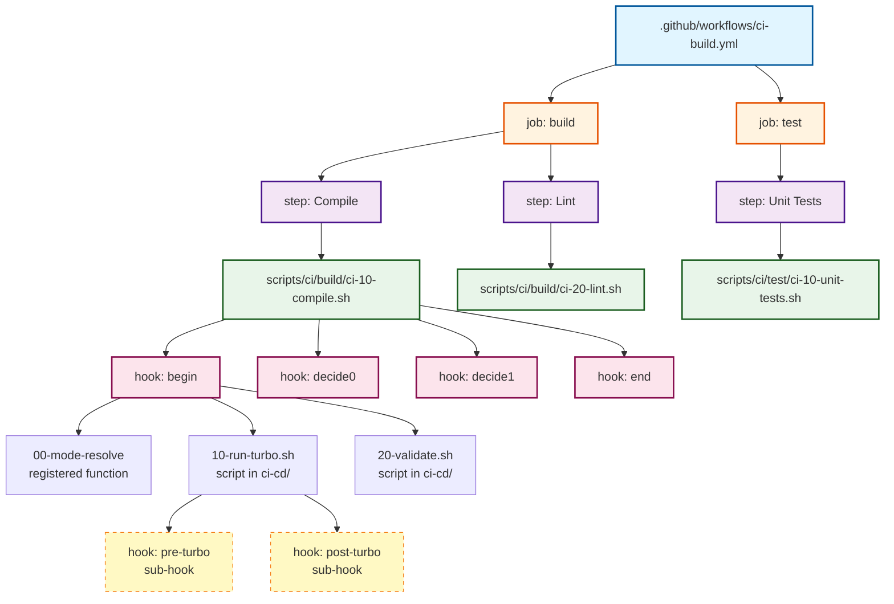

# Hooks and Modes Implementation Plan for ci-excellence

## Executive Summary

This plan details the integration of e-bash hooks and CI execution modes into the ci-excellence framework, designed as a **minimal overlay template** for monorepo projects. Following the "Dry" Script Architecture (Phase 3 of TRANSFORMATION_PLAN.md).

**Design Philosophy:** CIE provides generic hook points and infrastructure. Users customize for their specific build system (Turbo, npm workspaces, etc.) by implementing hooks. Simple, minimal, non-invasive.

**Latest Update (2025-12-25):** Refactored to use a **single reusable mode resolver library** (`_ci_modes.sh`) with function registration instead of per-script hook files. This approach provides:

- **Single source of truth** for mode resolution logic
- **Minimal boilerplate** (3 lines) in CI scripts
- **Hardcoded registration** via `hooks:register`
- **No duplication** of mode resolution code

---

## 1. Architecture Overview

### 1.1 Per-Script Hook Discovery

ci-excellence uses **per-script hook directories** for isolation and reusability:

```text
existing-monorepo/                  # User's existing project
├── package.json                    # Turbo, npm workspaces, etc.
├── turbo.json                      # Existing build config
├── packages/                       # User's packages
│   ├── frontend/
│   └── backend/
│
├── ci-cd/                          # CIE: User adds this folder
│   ├── ci-10-compile/              # Hooks ONLY for ci-10-compile.sh
│   │   ├── begin_00_mode-resolve.sh
│   │   ├── begin_20-run-turbo.sh
│   │   └── decide0_05_should-skip.sh
│   │
│   ├── ci-20-lint/                 # Hooks ONLY for ci-20-lint.sh
│   │   ├── begin_00_mode-resolve.sh
│   │   └── begin_10-custom-rules.sh
│   │
│   └── ci-30-unit-tests/           # Hooks ONLY for ci-30-unit-tests.sh
│       ├── begin_00_mode-resolve.sh
│       └── end_90-coverage-report.sh
│
└── scripts/                        # CIE: Copied from ci-excellence
    └── ci/
        ├── build/ci-10-compile.sh  # Sets HOOKS_DIR=ci-cd/ci-10-compile/
        ├── build/ci-20-lint.sh     # Sets HOOKS_DIR=ci-cd/ci-20-lint/
        └── test/ci-30-unit-tests.sh # Sets HOOKS_DIR=ci-cd/ci-30-unit-tests/
```

### 1.2 Per-Script HOOKS_DIR Pattern

**Each CI script sets its own HOOKS_DIR:**

```bash
# In ci-10-compile.sh:
export HOOKS_DIR="${PROJECT_ROOT}/ci-cd/${SCRIPT_NAME}"
# Result: HOOKS_DIR=.../ci-cd/ci-10-compile/
```

**Key characteristics:**

| Feature           | Implementation                                |
| ----------------- | --------------------------------------------- |
| **Isolation**     | Each script only sees its own hooks           |
| **Reusability**   | Same script can be used in multiple pipelines |
| **Customization** | Users customize each script independently     |
| **No conflicts**  | Hooks for different scripts don't interfere   |

### 1.3 Hook Naming Convention

**Pattern:** `{hook_name}_{NN}_{purpose}.sh`

| Hook Name       | Position | Purpose                                            |
| --------------- | -------- | -------------------------------------------------- |
| `begin_00_*`    | 00-09    | Mode resolution, early setup (optional, deletable) |
| `begin_10-39_*` | 10-39    | Environment setup, tool checks                     |
| `begin_40-89_*` | 40-89    | User's custom integration points (Turbo, etc.)     |
| `decide[0-9]_*` | -        | Decision points (skip, cache, route)               |
| `end_10-89_*`   | 10-89    | Cleanup, metrics, reports                          |

### 1.4 Integration with Build Systems

Users customize each CI script independently via its hook directory:

```bash
# ci-cd/ci-10-compile/begin_40-run-turbo.sh
#!/usr/bin/env bash
# Customizes ONLY ci-10-compile.sh

turbo run build --filter="...${CI_COMMIT_SHA}..."
```

```bash
# ci-cd/ci-20-lint/begin_30-run-turbo.sh
#!/usr/bin/env bash
# Customizes ONLY ci-20-lint.sh

turbo run lint --filter="...${CI_COMMIT_SHA}..."
```

**Benefits:**

- Each script can have different Turbo configurations
- Same script can be reused across pipelines with different hooks
- Users can delete/modify hooks without affecting other scripts

### 1.5 System Architecture

```text
┌─────────────────────────────────────────────────────────────────────────┐
│                    Configuration Hierarchy (4 levels)                   │
├─────────────────────────────────────────────────────────────────────────┤
│  CI_SCRIPT_MODE_CI_10_COMPILE=DRY ───┐                                  │
│  CI_STEP_MODE=OK                     ├──> Final Mode                    │
│  CI_PIPELINE_MODE=EXEC            ───┘   (EXEC/DRY/OK/ERROR/            │
│  CI_GLOBAL_MODE=DRY               ───┘    SKIP/TIMEOUT/TEST)            │
└─────────────────────────────────────────────────────────────────────────┘
                                        │
                                        ▼
┌─────────────────────────────────────────────────────────────────────────┐
│                   CI Script: ci-10-compile.sh                           │
│                   HOOKS_DIR=ci-cd/ci-10-compile/                        │
├─────────────────────────────────────────────────────────────────────────┤
│  1. Load: source scripts/lib/_ci_modes.sh                               │
│  2. Activate: ci_modes:activate (registers hook:ci_modes_resolve)       │
│  3. Hook Discovery: ci-cd/ci-10-compile/ (per-script directory)         │
│  4. Execute begin hooks (mode resolver runs first via "00-mode-resolve")│
│  5. Middleware parses contract directives from hook output              │
│  6. Apply flow directives (exit/route for OK/SKIP/ERROR/ROUTE modes)    │
│  7. Execute decide hooks (user's skip/cache decisions)                  │
│  8. Run main logic (or user's main-build.sh hook)                       │
│  9. Execute end hooks (cleanup, metrics)                                │
└─────────────────────────────────────────────────────────────────────────┘
                                        │
                                        ▼
┌─────────────────────────────────────────────────────────────────────────┐
│                  Hooks for ci-10-compile.sh ONLY                        │
├─────────────────────────────────────────────────────────────────────────┤
│  ci-cd/ci-10-compile/                                                   │
│  ├── begin_20_run-turbo.sh      (User's Turbo integration)              │
│  ├── decide0_05_should-skip.sh  (User's skip logic)                     │
│  └── end_99_summary.sh                                                  │
│                                                                         │
│  NOTE: Mode resolution handled by _ci_modes.sh library, not hook files  │
└─────────────────────────────────────────────────────────────────────────┘
```

---

## 2. Key Design Decisions

### 2.1 Per-Script Hook Directories

**Decision:** Each CI script has its own hook directory: `ci-cd/{script_name}/`

| Location                                    | Purpose                         | Required?       |
| ------------------------------------------- | ------------------------------- | --------------- |
| `ci-cd/ci-10-compile/`                      | Hooks for ci-10-compile.sh only | Folder optional |
| `ci-cd/ci-10-compile/begin_20_run-turbo.sh` | Turbo integration               | User-created    |
| `ci-cd/ci-20-lint/begin_10_custom-rules.sh` | Custom lint rules               | User-created    |

**Rationale:**

- **Isolation**: Hooks for different scripts don't interfere
- **Reusability**: Same script can be used in multiple pipelines
- **Customization**: Users customize each script independently
- **Simplicity**: No complex discovery, just `HOOKS_DIR=ci-cd/${SCRIPT_NAME}`
- **Mode resolution**: Handled by single `_ci_modes.sh` library

### 2.2 CI Modes: Single Reusable Library

**Decision:** CI modes implemented as **single shared library with function registration**

**File:** `scripts/ci/_ci_modes.sh`

**Location note:** Placed in `scripts/ci/` (not `scripts/lib/`) to separate e-bash generic libraries from ci-excellence-specific logic.

```bash
#!/usr/bin/env bash
# shellcheck disable=SC2155

## Copyright (C) 2025-present, ci-excellence contributors
## Last revisit: 2025-12-25
## Version: 1.0.0
## License: MIT

# Guard against multiple inclusion
if [[ -n "${__CI_MODES_LOADED:-}" ]]; then return 0; fi
readonly __CI_MODES_LOADED="true"

# Convert script name to env var format
# "ci-10-compile.sh" → "CI_SCRIPT_MODE_CI_10_COMPILE"
_ci_modes:script_to_env() {
  local script_name="${1%.sh}"      # Remove .sh
  script_name="${script_name^^}"     # Uppercase
  script_name="${script_name//-/_}"  # Hyphens to underscores
  echo "CI_SCRIPT_MODE_${script_name}"
}

# Resolve mode from hierarchy
_ci_modes:resolve() {
  local script_name="$1"
  local mode_var="$(_ci_modes:script_to_env "$script_name")"
  local mode="${!mode_var:-${CI_STEP_MODE:-${CI_PIPELINE_MODE:-${CI_GLOBAL_MODE:-EXEC}}}}"
  echo "$mode"
}

# Apply mode by outputting contract directives
_ci_modes:apply() {
  local mode="$1"
  case "$mode" in
    EXEC) echo:Modes "Mode: EXEC" ;;
    DRY)   echo "contract:env:DRY_RUN=true" ;;
    OK|SKIP) echo "contract:exit:0" ;;
    ERROR) echo "contract:exit:${CI_ERROR_CODE:-1}" ;;
    /*)
      if [[ -f "$mode" ]]; then
        echo "contract:route:${mode}"
      else
        echo "contract:exit:1"
      fi
      ;;
  esac
}

# Main hook function (registered via hooks:register)
# Reads SCRIPT_NAME from calling context
hook:ci_modes_resolve() {
  local script_name="${SCRIPT_NAME}.sh"
  local mode="$(_ci_modes:resolve "$script_name")"
  _ci_modes:apply "$mode"
  return 0
}

# One-line activation for CI scripts
ci_modes:activate() {
  hooks:register begin "00-mode-resolve" hook:ci_modes_resolve
  hooks:middleware begin _hooks:middleware:modes
  echo:Modes "CI mode resolver activated for: ${SCRIPT_NAME:-unknown}"
  return 0
}
```

**Key points:**

- **Single library**: All mode resolution logic in one file
- **Function registration**: Uses `hooks:register begin "00-mode-resolve" hook:ci_modes_resolve`
- **SCRIPT_NAME from context**: Reads `SCRIPT_NAME` from calling script's context
- **Minimal activation**: 3 lines in each CI script

### 2.3 Per-Script HOOKS_DIR Pattern

**Decision:** Each CI script sets `HOOKS_DIR=ci-cd/${SCRIPT_NAME}`

```bash
# In ci-10-compile.sh:
export HOOKS_DIR="${PROJECT_ROOT}/ci-cd/${SCRIPT_NAME}"
# Result: HOOKS_DIR=/project/ci-cd/ci-10-compile/
```

This ensures:

- **Isolation**: `ci-10-compile.sh` only sees hooks in `ci-cd/ci-10-compile/`
- **Reusability**: Same script can be reused across pipelines with different hooks
- **Customization**: Users create hooks specific to each CI script

### 2.4 Default Mode and Disabling

**Decision:** EXEC by default

- **With `ci_modes:activate`**: Modes work based on environment variables
- **Without activation**: Pure EXEC mode (production pipelines)
- **No default in code**: Forces explicit configuration via CI_* env vars

**To disable modes for production:** Simply omit the 3-line activation block from the CI script.

---

## 3. CI Modes Implementation

### 3.1 Mode Definitions

| Mode             | Behavior                      | Contract Output                   | Use Case           |
| ---------------- | ----------------------------- | --------------------------------- | ------------------ |
| EXEC             | Normal execution              | (none)                            | Default/production |
| DRY              | Print commands, don't execute | `contract:env:DRY_RUN=true`       | Testing/staging    |
| OK               | No-op, immediate success      | `contract:exit:0`                 | Skip temporarily   |
| ERROR            | No-op, fail with code         | `contract:exit:N`                 | Test failures      |
| SKIP             | No-op, exit 0                 | `contract:exit:0`                 | Disabled step      |
| /path/to/mock.sh | Run mock script instead       | `contract:route:/path/to/mock.sh` | A/B testing        |

### 3.2 CI Script Template (Single Library Approach)

**Template for:** `scripts/ci/build/ci-NN-name.sh`

**Minimal template** - `_hooks.sh` handles begin/end hooks automatically via `hooks:bootstrap`:

```bash
#!/usr/bin/env bash
# shellcheck disable=SC2155

## Copyright (C) 2025-present, ci-excellence contributors
## Last revisit: 2025-12-25
## Version: 1.0.0
## License: MIT

## CI Script: ci-NN-name.sh
## Environment Variables: CI_GLOBAL_MODE, CI_PIPELINE_MODE, CI_STEP_MODE, CI_SCRIPT_MODE_CI_NN_NAME
## Modes: EXEC, DRY, OK, ERROR, SKIP, /path/to/mock.sh

# set configuration variables before the source'ing called
export DEBUG="${DEBUG:-ci}"

readonly SCRIPT_NAME="$(basename "${BASH_SOURCE[0]}" .sh)"
readonly PROJECT_ROOT="$(cd "$(dirname "${BASH_SOURCE[0]}")" && pwd)/../.."
export HOOKS_DIR="${PROJECT_ROOT}/ci-cd/${SCRIPT_NAME}"

# quick project setup check
[ -z "$E_BASH" ] && { echo "ERROR: E_BASH not set" >&2; exit 1; }

# source "$E_BASH/_colors.sh" # automatically sourced by _logger.sh
# source "$E_BASH/_logger.sh" # automatically sourced by _dryrun, _traps or _hooks`
# source "$E_BASH/_traps.sh" # automatically sourced by _hooks.sh
source "$E_BASH/_dryrun.sh"
source "$E_BASH/_hooks.sh"

# === CI MODES ACTIVATION (3 lines) ===
source "$PROJECT_ROOT/scripts/ci/_ci_modes.sh" && ci_modes:activate
# ======================================

logger:init ci "${cl_blue}[${SCRIPT_NAME}]${cl_reset} " ">&2"
hooks:declare decide0 decide1 decide2 decide3 decide4 decide5 
dry-run npm node turbo cargo go mvn gradle

# hooks:bootstrap (in _hooks.sh) auto-declares begin/end and installs EXIT trap

echo:Ci "${st_b}=== ${SCRIPT_NAME} ===${st_no_b}"
hooks:do begin "${SCRIPT_NAME}" && hooks:flow:apply || exit $?

# Main logic
dry:npm run build 2>/dev/null || dry:turbo run build 2>/dev/null || echo:Ci "No build command found"
```

**Key simplifications:**

- `hooks:bootstrap` (auto-run by `_hooks.sh`) declares `begin`/`end` hooks and sets up EXIT trap
- No need to manually define `hook:end()` - `hooks:bootstrap` handles it
- `HOOKS_AUTO_TRAP=true` by default ensures end hooks run on script exit

### 3.3 How It Works

1. **CI script loads library**: `source "$E_BASH/_ci_modes.sh"`
2. **CI script activates modes**: `ci_modes:activate` which:
   - Registers `hook:ci_modes_resolve` with friendly name "00-mode-resolve"
   - Sets middleware to `_hooks:middleware:modes`
3. **When `hooks:do begin` executes:**
   - Registered functions run in alphabetical order by friendly name
   - "00-mode-resolve" runs first, reads `SCRIPT_NAME` from calling context
   - Outputs `contract:*` directive based on resolved mode
4. **Middleware captures output**, parses contracts, sets environment variables
5. **`hooks:flow:apply`** exits or routes if contract specified

---

## 4. Key Characteristics

| Feature                   | Implementation                                                 |
| ------------------------- | -------------------------------------------------------------- |
| **Single library**        | `scripts/ci/_ci_modes.sh` - one file for all scripts           |
| **Function registration** | `hooks:register begin "00-mode-resolve" hook:ci_modes_resolve` |
| **Per-script hooks**      | `export HOOKS_DIR="${PROJECT_ROOT}/ci-cd/${SCRIPT_NAME}"`      |
| **Isolation**             | Each script only sees its own hooks                            |
| **Reusability**           | Same script can be used in multiple pipelines                  |
| **Customization**         | Users create hooks in `ci-cd/{script_name}/`                   |
| **Main logic**            | Via hooks or direct script edits                               |
| **Auto hooks**            | `hooks:bootstrap` auto-declares begin/end + EXIT trap          |

---

## 5. File Structure (Single Library Approach)

```text
existing-monorepo/                  # User's existing project
├── package.json                    # User's existing setup
├── turbo.json                      # Build system config
├── packages/                       # User's packages
│   ├── frontend/
│   └── backend/
│
├── ci-cd/                          # CIE: User adds this folder
│   ├── ci-10-compile/              # Hooks ONLY for ci-10-compile.sh
│   │   ├── begin_20-run-turbo.sh       # User's Turbo integration
│   │   ├── decide0_05_should-skip.sh   # User's skip logic
│   │   └── main-build.sh               # User's build command (optional)
│   │
│   ├── ci-20-lint/                 # Hooks ONLY for ci-20-lint.sh
│   │   └── begin_10-custom-rules.sh
│   │
│   └── ci-30-unit-tests/           # Hooks ONLY for ci-30-unit-tests.sh
│       └── end_90-coverage-report.sh
│
├── scripts/                        # CIE: Copied from ci-excellence
│   ├── lib/
│   │   ├── _hooks.sh               # From e-bash (v1.12.6) ✅
│   │   ├── _logger.sh              # From e-bash ✅
│   │   ├── _dryrun.sh              # From e-bash ✅
│   │   ├── _traps.sh               # From e-bash ✅
│   │   ├── _colors.sh              # From e-bash ✅
│   │   └── (other e-bash libs)
│   │
│   └── ci/
│       ├── _ci_modes.sh            # Single mode resolver library ✅
│       ├── build/
│       │   ├── ci-10-compile.sh    # With 3-line modes activation
│       │   └── ci-20-lint.sh       # With 3-line modes activation
│       ├── test/
│       │   └── ci-30-unit-tests.sh
│       ├── release/
│       └── maintenance/
│
└── .github/
    └── workflows/                  # MAIN DELIVERY: CI pipelines
        ├── ci-build.yml            # Compile, lint, bundle
        ├── ci-test.yml             # Unit, integration, e2e tests
        ├── ci-security.yml         # Security scanning
        ├── ci-release.yml          # Release automation
        └── ci-maintenance.yml      # Maintenance tasks
```

**Note:**

- `_ci_modes.sh` in `scripts/ci/` separates ci-excellence logic from e-bash generic libraries
- `.github/workflows/` is the main delivery mechanism - CI scripts are called from here

---

## 6. Implementation Phases

### Phase 1: Foundation ✅ (Already Done)

| Task | File                     | Status                  |
| ---- | ------------------------ | ----------------------- |
| 1.1  | `scripts/lib/_hooks.sh`  | [x] From e-bash v1.12.6 |
| 1.2  | `scripts/lib/_logger.sh` | [x] From e-bash v1.12.6 |
| 1.3  | `scripts/lib/_dryrun.sh` | [x] From e-bash v1.12.6 |
| 1.4  | `scripts/lib/_traps.sh`  | [x] From e-bash v1.12.6 |
| 1.5  | `scripts/lib/_colors.sh` | [x] From e-bash v1.12.6 |

### Phase 2: Mode Resolver Library

| Task | File                      | Action                        |
| ---- | ------------------------- | ----------------------------- |
| 2.1  | `scripts/ci/_ci_modes.sh` | CREATE - Single mode resolver |
| 2.2  | `docs/HOOKS_PLANNING.md`  | [x] Updated with new design   |

### Phase 3: Script Migration

| Priority | Scripts                             | Action                                    |
| -------- | ----------------------------------- | ----------------------------------------- |
| P0       | `scripts/ci/build/ci-10-compile.sh` | Update with per-script HOOKS_DIR template |
| P0       | `scripts/ci/build/ci-20-lint.sh`    | Update with per-script HOOKS_DIR template |
| P1       | All test scripts                    | Update with per-script HOOKS_DIR template |

### Phase 4: Example Hooks

| Task | File                                        | Action                         |
| ---- | ------------------------------------------- | ------------------------------ |
| 4.1  | `ci-cd/ci-10-compile/begin_40-run-turbo.sh` | Example Turbo integration      |
| 4.2  | `ci-cd/ci-20-lint/begin_30-run-turbo.sh`    | Example Turbo integration lint |

---

## 7. Critical Files

| Path                                | Purpose                                |
| ----------------------------------- | -------------------------------------- |
| `scripts/ci/_ci_modes.sh`           | Single mode resolver library           |
| `scripts/lib/_hooks.sh`             | Core e-bash hooks system (v1.12.6) [x] |
| `scripts/ci/build/ci-10-compile.sh` | First script to migrate (reference)    |
| `.github/workflows/ci-build.yml`    | Main delivery: CI pipeline definition  |
| `docs/HOOKS_GUIDE.md`               | User guide (to be created)             |

---

## 8. GitHub Workflows - Main Delivery

**`.github/workflows/` is the primary delivery mechanism** - CI scripts are orchestrated here.

### Example Workflow: ci-build.yml

```yaml
name: CI Build

on:
  push:
    branches: [main, develop]
  pull_request:

jobs:
  build:
    runs-on: ubuntu-latest
    steps:
      - uses: actions/checkout@v4

      # Setup
      - name: Install dependencies
        run: ./scripts/ci/setup/ci-10-install-tools.sh

      # Build phase (with modes)
      - name: Compile
        run: ./scripts/ci/build/ci-10-compile.sh
        env:
          CI_GLOBAL_MODE: ${{ github.event_name == 'pull_request' && 'DRY' || 'EXEC' }}

      - name: Lint
        run: ./scripts/ci/build/ci-20-lint.sh

      - name: Bundle
        run: ./scripts/ci/build/ci-40-bundle.sh
```

### Mode Configuration in Workflows

| Scenario             | Mode Configuration                                       |
| -------------------- | -------------------------------------------------------- |
| Production           | `CI_GLOBAL_MODE: EXEC`                                   |
| PR testing (DRY)     | `CI_GLOBAL_MODE: DRY`                                    |
| Script-specific skip | `CI_SCRIPT_MODE_CI_20_LINT: OK` (skip lint step)         |
| Staging test         | `CI_PIPELINE_MODE: DRY`                                  |
| Local testing        | `CI_GLOBAL_MODE=DRY ./scripts/ci/build/ci-10-compile.sh` |

---

## 9. Example Hooks for Turbo Integration

### 9.1 Turbo Integration for Compile

**File:** `ci-cd/ci-10-compile/begin_40-run-turbo.sh`

```bash
#!/usr/bin/env bash
# User's Turbo integration for compile step

# Get affected packages based on git changes
AFFECTED=$(turbo run build --dry-run --filter="...${CI_COMMIT_SHA}..." 2>/dev/null || echo "")

echo "[turbo] Running build for affected packages: ${AFFECTED}" >&2

turbo run build --filter="...${CI_COMMIT_SHA}..."
```

### 9.2 Turbo Integration for Lint

**File:** `ci-cd/ci-20-lint/begin_30-run-turbo.sh`

```bash
#!/usr/bin/env bash
# User's Turbo integration for lint step

# Lint all changed packages
turbo run lint --filter="...${CI_COMMIT_SHA}..."
```

### 9.3 Monorepo Skip Decision

**File:** `ci-cd/ci-10-compile/decide0_05_monorepo-skip.sh`

```bash
#!/usr/bin/env bash
# User's skip logic for compile step

# Check if any source files changed
CHANGED=$(git diff --name-only HEAD~1 HEAD | grep -E "\.(ts|tsx|js|jsx)$" || echo "")

if [[ -z "$CHANGED" ]]; then
    echo "Skip"  # No source changes, skip compile
else
    echo "Continue"
fi
```

---

## 10. Turbo Integration Example

### User's Existing Monorepo (before CIE)

```text
my-monorepo/
├── package.json
├── turbo.json
├── packages/
│   ├── web/
│   └── api/
└── .github/workflows/
    └── ci.yml  # Custom workflows
```

### After Applying CIE

```text
my-monorepo/
├── package.json                        # Existing
├── turbo.json                          # Existing
├── packages/                           # Existing
│   ├── web/
│   └── api/
│
├── ci-cd/                              # NEW: Per-script hook directories
│   ├── ci-10-compile/
│   │   ├── begin_40-run-turbo.sh       # User's Turbo for compile
│   │   └── decide0_05_should-skip.sh    # User's skip logic
│   │
│   ├── ci-20-lint/
│   │   └── begin_30-run-turbo.sh       # User's Turbo for lint
│   │
│   └── ci-30-unit-tests/
│       └── end_90-coverage-report.sh
│
├── scripts/                            # NEW: Copied from CIE
│   ├── lib/
│   │   └── _ci_modes.sh               # Mode resolver library
│   └── ci/
│       ├── build/ci-10-compile.sh      # With 3-line modes activation
│       ├── build/ci-20-lint.sh         # With 3-line modes activation
│       └── test/ci-30-unit-tests.sh
│
└── .github/workflows/                  # UPDATED: Use CIE scripts
    └── ci.yml
```

**Note:** Mode resolution handled by `_ci_modes.sh` library, no per-script mode hooks needed.

### Example Workflow (GitHub Actions)

```yaml
# .github/workflows/ci.yml
name: CI

on: push

jobs:
  build:
    runs-on: ubuntu-latest
    steps:
      - uses: actions/checkout@v4

      - name: Compile
        run: ./scripts/ci/build/ci-10-compile.sh
        env:
          CI_GLOBAL_MODE: EXEC  # Production mode

      - name: Lint
        run: ./scripts/ci/build/ci-20-lint.sh
        env:
          CI_GLOBAL_MODE: EXEC
```

---

## 11. Migration Checklist

### For CIE Developers

- [ ] Create `scripts/ci/_ci_modes.sh` library
- [ ] Update CI scripts with 3-line modes activation
- [ ] Create `docs/HOOKS_GUIDE.md` user guide
- [ ] Create Turbo integration examples
- [ ] Update GitHub Actions workflows

### For End Users (applying CIE)

- [ ] Copy `scripts/` from CIE to project
- [ ] Create hook directories: `ci-cd/ci-10-compile/`, `ci-cd/ci-20-lint/`, etc.
- [ ] Implement hooks for build system integration
- [ ] Create/update `.github/workflows/*.yml` to call CI scripts

---

## 12. Troubleshooting Guide

| Issue                | Symptom                                 | Solution                                             |
| -------------------- | --------------------------------------- | ---------------------------------------------------- |
| Hook not found       | "No implementations found"              | Verify hook directory exists: `ci-cd/ci-10-compile/` |
| Wrong script's hooks | Hooks from one script affecting another | Check HOOKS_DIR points to correct script directory   |
| Mode not applied     | Modes not working                       | Verify `ci_modes:activate` is called in script       |
| Pure production mode | Want to disable modes                   | Remove the 3-line activation block from CI script    |

---

## 13. Testing Checklist

```bash
# 1. Test default EXEC mode (production)
./scripts/ci/build/ci-10-compile.sh

# 2. Test DRY mode
CI_GLOBAL_MODE=DRY ./scripts/ci/build/ci-10-compile.sh

# 3. Test script-specific override
CI_SCRIPT_MODE_CI_10_COMPILE=OK ./scripts/ci/build/ci-10-compile.sh

# 4. Test mode hierarchy (script-specific wins)
CI_GLOBAL_MODE=ERROR CI_SCRIPT_MODE_CI_10_COMPILE=DRY ./scripts/ci/build/ci-10-compile.sh

# 5. Test Turbo integration
./ci-cd/ci-10-compile/begin_40-run-turbo.sh
```

---

## 14. CI Pipeline Visualization

### 14.1 Architecture Overview

CI pipelines have a hierarchical structure that can be visualized for better understanding:

```text
┌─────────────────────────────────────────────────────────────────────────┐
│                         .github/workflows/                              │
│                              │                                          │
│                    ┌───────┴────────┐                                   │
│                    │  CI Workflow   │                                   │
│                    │  (ci-build.yml)│                                   │
│                    └───────┬────────┘                                   │
│                            │                                            │
│          ┌─────────────────┼─────────────────┐                          │
│          │                 │                 │                          │
│     ┌────▼────┐      ┌─────▼─────┐      ┌────▼────┐                     │
│     │   Job   │      │    Job    │      │   Job   │                     │
│     │  build  │      │   test    │      │ deploy  │                     │
│     └────┬────┘      └─────┬─────┘      └────┬────┘                     │
│          │                 │                 │                          │
│     ┌────▼────┐      ┌─────▼─────┐      ┌────▼────┐                     │
│     │  Step   │      │   Step    │      │  Step   │                     │
│     │compile  │      │unit-test  │      │publish  │                     │
│     └────┬────┘      └─────┬─────┘      └────┬────┘                     │
│          │                 │                 │                          │
│     ┌────▼─────────────────▼─────────────────▼────┐                     │
│     │          scripts/ci/build/ci-10-compile.sh  │                     │
│     │          (CI Script with hooks system)      │                     │
│     └────┬────────────────────────────────────────┘                     │
│          │                                                              │
│     ┌────▼─────────────────────────────────────────────────────────┐    │
│     │  Hooks: begin → decide0 → decide1 → ... → decide9 → end      │    │
│     │  │                                                           │    │
│     │  ├── begin hooks (from HOOKS_DIR + registered functions)     │    │
│     │  │   ├── 00-mode-resolve (registered: hook:ci_modes_resolve) │    │
│     │  │   ├── 10-run-turbo.sh (script in ci-cd/)                  │    │
│     │  │   └── 20-validate.sh (script in ci-cd/)                   │    │
│     │  │                                                           │    │
│     │  ├── decide0 hooks (from HOOKS_DIR)                          │    │
│     │  │   └── 05_should-skip.sh                                   │    │
│     │  │                                                           │    │
│     │  └── end hooks (from HOOKS_DIR + registered functions)       │    │
│     │      └── 99-summary.sh                                       │    │
│     └──────────────────────────────────────────────────────────────┘    │
│                                                                         │
│  Sub-hooks: Hooks can be declared within other hooks for                │
│  nested execution patterns (e.g., rollback hooks calling                │
│  sub-hooks for specific cleanup tasks)                                  │
└─────────────────────────────────────────────────────────────────────────┘
```

### 14.2 Hierarchy Levels

| Level        | Location                  | Example                               | Description                          |
| ------------ | ------------------------- | ------------------------------------- | ------------------------------------ |
| **Workflow** | `.github/workflows/*.yml` | `ci-build.yml`                        | GitHub Actions workflow definition   |
| **Job**      | Workflow `jobs:` block    | `build`, `test`                       | Top-level workflow job               |
| **Step**     | Job `steps:` block        | `Compile`, `Test`                     | Individual step within a job         |
| **Script**   | Step `run:` command       | `./scripts/ci/build/ci-10-compile.sh` | Executable CI script                 |
| **Hook**     | `ci-cd/{script_name}/`    | `begin_20-run-turbo.sh`               | Hook implementation for script       |
| **Sub-hook** | Within hook execution     | Nested `hooks:do` calls               | Hooks called from within other hooks |

### 14.3 Visualization Tool

**Location:** `scripts/dev/visualize-ci-pipeline.ts`

**Runtime:** Bun (fast JavaScript runtime with native TypeScript support)

**Purpose:** Parse CI structure and generate Mermaid diagrams for visualization

#### Features

1. **Workflow Parsing**: Parse `.github/workflows/*.yml` files
2. **Script Analysis**: Extract hook declarations and usages from CI scripts
3. **Hook Discovery**: Find hook implementations in `ci-cd/` directories
4. **Sub-hook Detection**: Identify nested `hooks:do` calls within hooks
5. **Mermaid Generation**: Output Mermaid diagram syntax

#### Usage

```bash
# Visualize entire CI pipeline
bun run visualize:ci

# Visualize specific workflow
bun run visualize:ci -- --workflow=ci-build.yml

# Visualize specific script
bun run visualize:ci -- --script=ci-10-compile.sh

# Output to file
bun run visualize:ci -- --output=docs/ci-pipeline-diagram.md

# Direct TypeScript execution (Bun has native TS support)
bun scripts/dev/visualize-ci-pipeline.ts --workflow=ci-build.yml
```

#### package.json Scripts

```json
{
  "scripts": {
    "visualize:ci": "bun scripts/dev/visualize-ci-pipeline.ts",
    "visualize:ci:node": "ts-node scripts/dev/visualize-ci-pipeline.ts"
  }
}
```

#### Mermaid Output Format



### 14.4 Implementation Plan

| Task | File                                   | Action                                 |
| ---- | -------------------------------------- | -------------------------------------- |
| 14.1 | `scripts/dev/visualize-ci-pipeline.ts` | Create TypeScript parser               |
| 14.2 | `scripts/dev/visualize-ci-pipeline.ts` | YAML workflow parser                   |
| 14.3 | `scripts/dev/visualize-ci-pipeline.ts` | Bash script parser (hook declarations) |
| 14.4 | `scripts/dev/visualize-ci-pipeline.ts` | Hook discovery in `ci-cd/` directories |
| 14.5 | `scripts/dev/visualize-ci-pipeline.ts` | Sub-hook detection (nested `hooks:do`) |
| 14.6 | `scripts/dev/visualize-ci-pipeline.ts` | Mermaid diagram generator              |
| 14.7 | `package.json`                         | Add `visualize:ci` bun script          |
| 14.8 | `docs/CI_PIPELINE_DIAGRAM.md`          | Auto-generated documentation           |

### 14.5 TypeScript Parser Design

```typescript
// scripts/dev/visualize-ci-pipeline.ts

interface Workflow {
  name: string;
  file: string;
  jobs: Job[];
}

interface Job {
  name: string;
  steps: Step[];
}

interface Step {
  name: string;
  script?: string; // Path to CI script if applicable
}

interface CIScript {
  name: string;
  file: string;
  hooks: string[]; // Declared hooks
  hookImplementations: HookImplementation[];
}

interface HookImplementation {
  name: string;
  type: 'registered-function' | 'script';
  source: string;
  subHooks?: string[]; // Nested hooks called within
}

class CIPipelineVisualizer {
  // Parse .github/workflows/*.yml
  parseWorkflows(dir: string): Workflow[]

  // Parse CI script for hook declarations
  parseCIScript(scriptPath: string): CIScript

  // Discover hook implementations in ci-cd/{script_name}/
  discoverHookImplementations(hooksDir: string, hookName: string): HookImplementation[]

  // Detect sub-hooks (nested hooks:do calls)
  detectSubHooks(hookContent: string): string[]

  // Generate Mermaid diagram
  generateMermaid(pipeline: Workflow): string
}
```

### 14.6 Example Generated Documentation

**File:** `docs/CI_PIPELINE_DIAGRAM.md` (auto-generated)

```markdown
# CI Pipeline Visualization

Generated: 2025-12-25

## Workflow: ci-build.yml

### Jobs: build

#### Step: Compile
- **Script:** `scripts/ci/build/ci-10-compile.sh`
- **Hooks:** begin, decide0, decide1, decide2, decide3, decide4, decide5, end

**Begin Hook Implementations:**
| Name            | Type                | Source                                      |
| --------------- | ------------------- | ------------------------------------------- |
| 00-mode-resolve | registered-function | `ci_modes:activate`                         |
| 10-run-turbo    | script              | `ci-cd/ci-10-compile/begin_10-run-turbo.sh` |
| 20-validate     | script              | `ci-cd/ci-10-compile/begin_20-validate.sh`  |

**Sub-hooks** (nested within `begin_10-run-turbo.sh`):
- `pre-turbo` - Environment setup before turbo
- `post-turbo` - Cleanup after turbo

#### Step: Lint
- **Script:** `scripts/ci/build/ci-20-lint.sh`
- **Hooks:** begin, decide0, decide1, decide2, decide3, decide4, decide5, end

...
```

---

**End of Planning Document**
