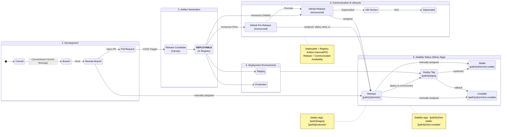

# Project State Machine

This document illustrates the release lifecycle of the project, strictly following the flow from local development to production deployment and stability management.

## Release State Machine

## State Descriptions

### 1. Development
- **Local Changes**: Work in progress on a developer's machine.
- **Pushed to Branch**: Changes committed (using specific conventional commit messages) and pushed to the repository.
- **Pull Request**: Code is ready for review and integration.

### 2. Artifact Generation
- **Release Candidate (Canary)**: A temporary build generated from a PR or development branch for testing.
- **Deployable**: An immutable artifact published to the registry (NPM, Docker). This is an internal state; the artifact exists but is not yet publicly announced as a "Release".

### 3. Communication & Lifecycle
- **GitHub Pre-Release**: The artifact is announced as a beta/alpha release on GitHub.
- **GitHub Release**: The artifact is officially released and announced as stable.
- **Old / Deprecated**: As new releases come out, older ones move to "Old" and eventually "Deprecated".

### 4. Deployment Environments
- **Staging**: The deployable is running in the staging environment.
- **Production**: The deployable is live in production.

### 5. Stability Status (Sticky)
- **Release (Neutral)**: The default state of a new release.
- **Staged (Stable)**: Explicitly tagged as stable/verified.
- **Unstaged (Unstable)**: Explicitly tagged as unstable (e.g., after a rollback or critical bug).
- These states form a loop: a release can move between Neutral, Stable, and Unstable as its status changes.
